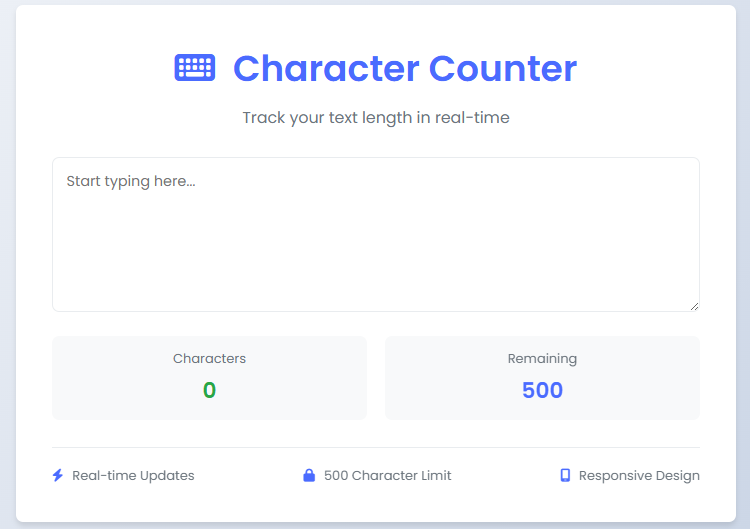

# Professional Character Counter

A modern, responsive character counter application built with HTML, CSS, and JavaScript. This tool provides real-time character counting with a beautiful user interface and smooth animations.



## Features

- 🚀 Real-time character counting
- 📱 Fully responsive design
- 🎨 Modern and clean UI
- ⚡ Smooth animations and transitions
- 🎯 Color-coded character limits
- 📊 Visual feedback on character usage
- 🔒 500 character limit with warning indicators

## Technologies Used

- HTML5
- CSS3 (with CSS Variables)
- Vanilla JavaScript
- Font Awesome Icons
- Google Fonts (Poppins)

## Installation

1. Clone the repository:
```bash
git clone https://github.com/LiyemaSwartooi/Professional-Character-Counter.git
```

2. Navigate to the project directory:
```bash
cd Professional-Character-Counter
```

3. Open `Real-time Character Counter.html` in your web browser.

## Usage

1. Start typing in the text area
2. Watch the character count update in real-time
3. The remaining characters will change color based on usage:
   - Blue: Normal usage
   - Yellow: Less than 30% remaining
   - Red: Less than 10% remaining

## Features in Detail

### Real-time Updates
The counter updates instantly as you type, providing immediate feedback on your text length.

### Responsive Design
The application adapts to all screen sizes, from mobile devices to desktop computers.

### Visual Feedback
- Smooth animations when counters update
- Color-coded remaining characters
- Clean, modern interface

### Character Limit
- Maximum of 500 characters
- Visual warnings when approaching the limit
- Clear indication of remaining space

## Contributing

Contributions are welcome! Please feel free to submit a Pull Request.

## License

This project is licensed under the MIT License - see the LICENSE file for details.

## Author

- **Liyema Swartooi** - [GitHub Profile](https://github.com/LiyemaSwartooi)

## Acknowledgments

- Font Awesome for the beautiful icons
- Google Fonts for the Poppins font family
- All contributors who have helped improve this project
